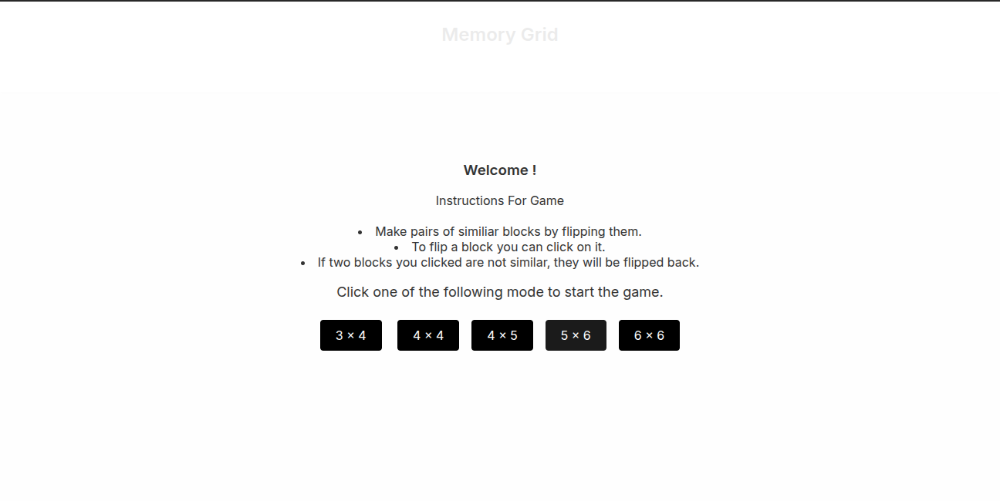
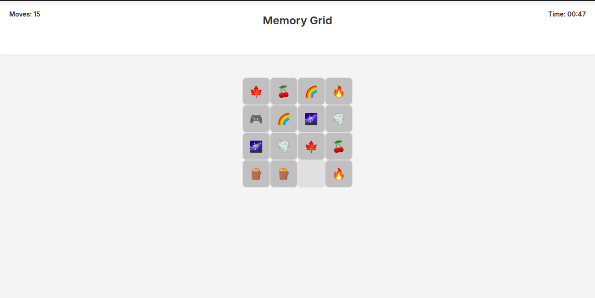
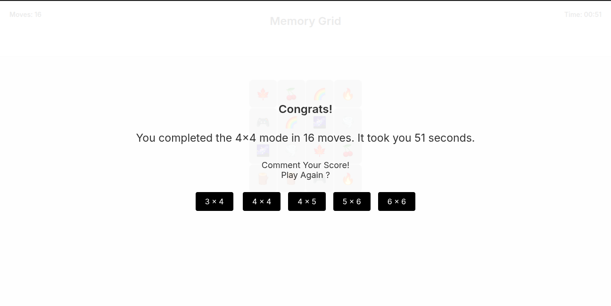

# 🧠 Memory Matching Game

A minimalist, browser-based memory game built with **HTML**, **CSS**, and **JavaScript**.

Test your memory skills by flipping cards to find matching pairs. Each level increases the challenge.

---

## ✨ Features

- Clean and responsive design  
- Multiple levels of increasing difficulty  
- Simple and addictive gameplay  
- Emoji-based icons for a fun visual twist  

---

## 🚀 Getting Started

No setup required. Just clone the repo and open `index.html` in your browser:

```bash
git clone https://github.com/poojasoftiatric/Memory-Grid.git
cd memory-matching-game
open index.html
```

---

### Here are some snapshots from game.




